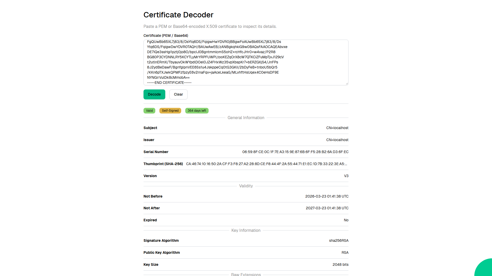

# Certificate Decoder

A web application that decodes and inspects X.509 certificates. Paste a PEM or Base64-encoded certificate to view its subject, issuer, validity, key information, SANs, key usage, and raw extensions.



Web application created using [Ivy](https://github.com/Ivy-Interactive/Ivy).

## Required Secrets

No secrets required for this project.

## Live Demo

<https://ivy-agent-demos-certificate-decoder.sliplane.app>

## Run

```
dotnet watch
```

## Deploy

```
ivy deploy
```
