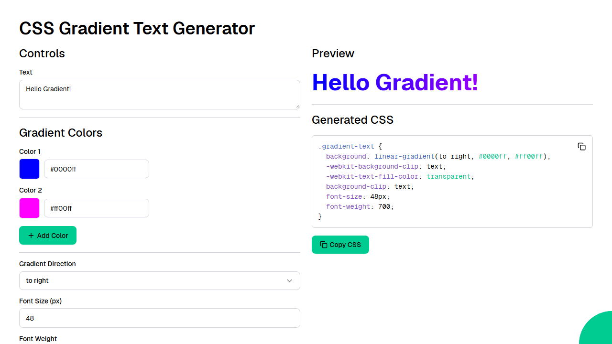

# CSS Gradient Text Generator

An interactive tool for creating CSS gradient text effects. Customize gradient colors, direction, font size, and weight with a live preview, then copy the generated CSS to your clipboard.



Web application created using [Ivy](https://github.com/Ivy-Interactive/Ivy).

## Required Secrets

No secrets required for this project.

## Live Demo

<https://ivy-agent-demos-css-gradient-text-generator.sliplane.app>

## Run

```
dotnet watch
```

## Deploy

```
ivy deploy
```
