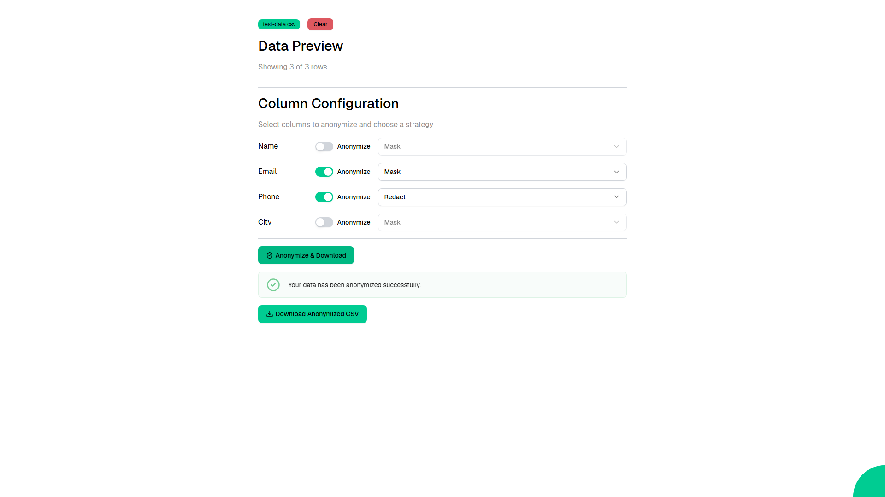

# Data Anonymizer

Upload a CSV file and anonymize sensitive data columns using configurable strategies including masking, hashing, randomizing, or full redaction. Download the anonymized result as a new CSV.



Web application created using [Ivy](https://github.com/Ivy-Interactive/Ivy).

## Required Secrets

No secrets required for this project.

## Live Demo

<https://ivy-agent-demos-data-anonymizer.sliplane.app>

## Run

```
dotnet watch
```

## Deploy

```
ivy deploy
```
