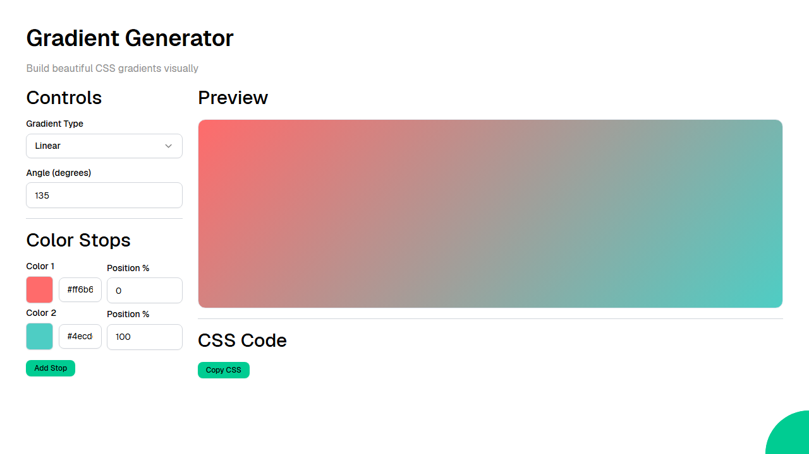

# Gradient Generator

A visual CSS gradient builder that lets you create linear, radial, and conic gradients with customizable color stops, angles, and live preview with one-click CSS code copying.



Web application created using [Ivy](https://github.com/Ivy-Interactive/Ivy).

## Required Secrets

No secrets required for this project.

## Live Demo

<https://ivy-agent-demos-gradient-generator.sliplane.app>

## Run

```
dotnet watch
```

## Deploy

```
ivy deploy
```
