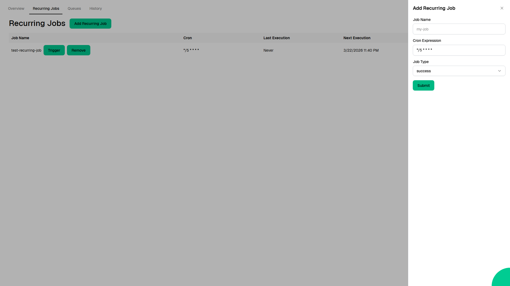

# Hangfire Job Dashboard

A real-time dashboard for monitoring and managing Hangfire background jobs, featuring an overview of job states, recurring job management, queue monitoring, and job execution history.



Web application created using [Ivy](https://github.com/Ivy-Interactive/Ivy).

## Required Secrets

No secrets required for this project.

## Live Demo

<https://ivy-agent-demos-hangfire-job-dashboard.sliplane.app>

## Run

```
dotnet watch
```

## Deploy

```
ivy deploy
```
