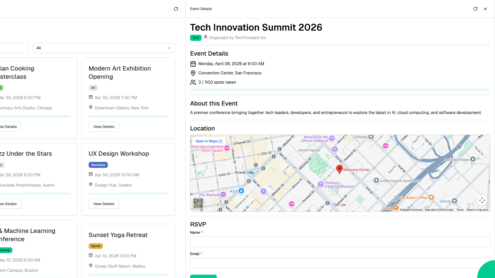

# Lovable Event Planner

An event planning and management app for browsing, creating, and RSVPing to events across categories like conferences, workshops, and social gatherings.



Web application created using [Ivy](https://github.com/Ivy-Interactive/Ivy).

## Required Secrets

No secrets required for this project.

## Live Demo

<https://ivy-agent-demos-lovable-event-planner.sliplane.app>

## Run

```
dotnet watch
```

## Deploy

```
ivy deploy
```
