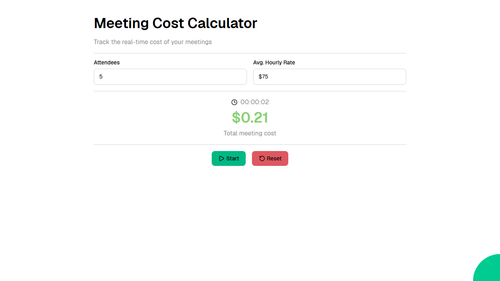

# Meeting Cost Calculator

A real-time meeting cost tracker that calculates expenses based on the number of attendees and their average hourly rate, with start/pause/reset controls.



Web application created using [Ivy](https://github.com/Ivy-Interactive/Ivy).

## Required Secrets

No secrets required for this project.

## Live Demo

<https://ivy-agent-demos-meeting-cost-calculator.sliplane.app>

## Run

```
dotnet watch
```

## Deploy

```
ivy deploy
```
