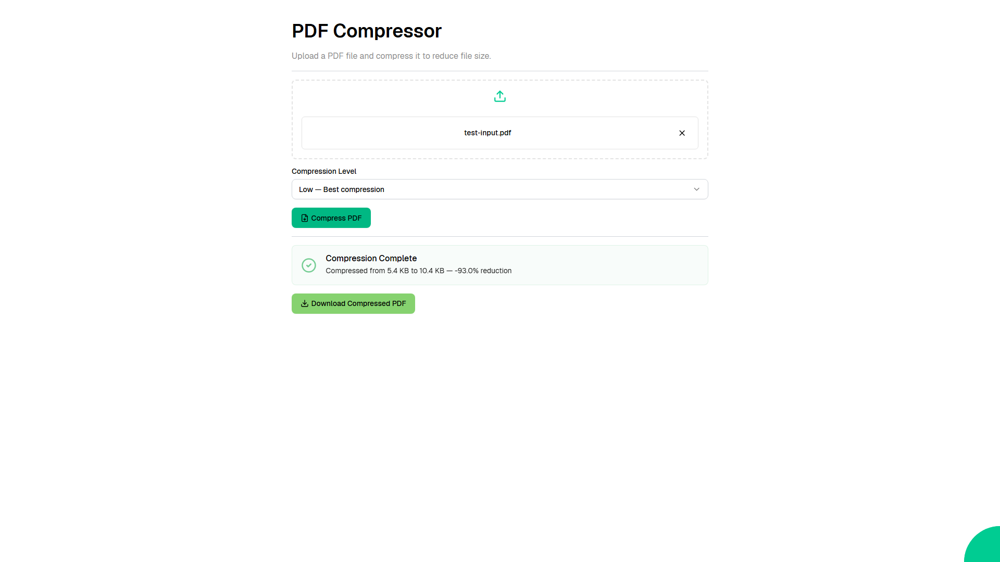

# PDF Compressor

A web application that lets you upload PDF files and compress them to reduce file size, with adjustable compression quality levels (low, medium, high).



Web application created using [Ivy](https://github.com/Ivy-Interactive/Ivy).

## Required Secrets

No secrets required for this project.

## Live Demo

<https://ivy-agent-demos-pdf-compressor.sliplane.app>

## Run

```
dotnet watch
```

## Deploy

```
ivy deploy
```
