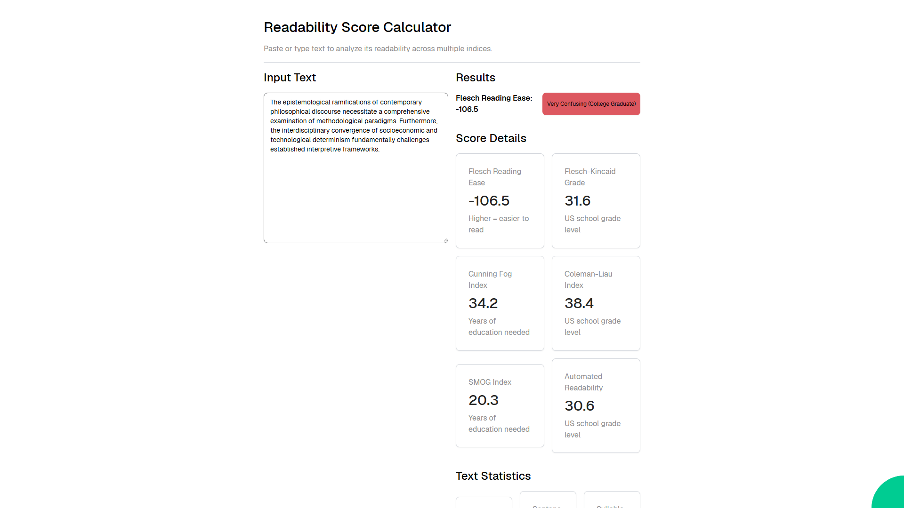

# Readability Score Calculator

Analyze text readability across multiple indices including Flesch Reading Ease, Flesch-Kincaid Grade Level, Gunning Fog, Coleman-Liau, SMOG, and Automated Readability Index, with detailed text statistics.



Web application created using [Ivy](https://github.com/Ivy-Interactive/Ivy).

## Required Secrets

No secrets required for this project.

## Live Demo

<https://ivy-agent-demos-readability-score-calculator.sliplane.app>

## Run

```
dotnet watch
```

## Deploy

```
ivy deploy
```
