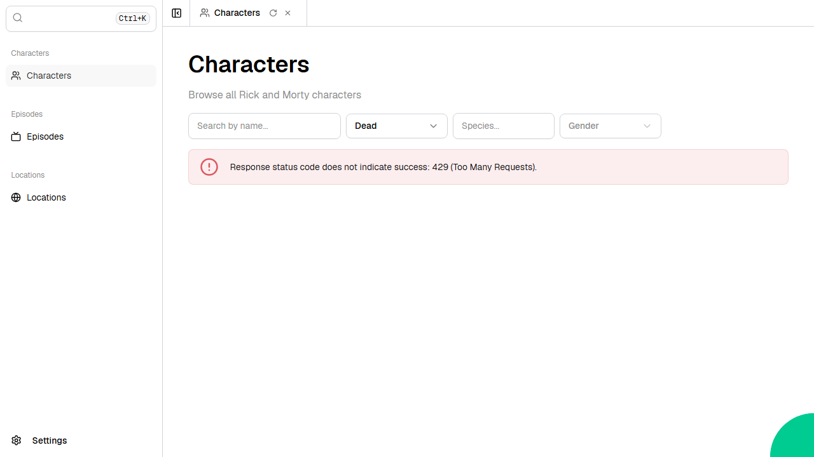

# Rick and Morty GraphQL

An interactive explorer for the Rick and Morty universe, built using the Rick and Morty GraphQL API. Browse, search, and filter characters, episodes, and locations with paginated views and detailed character sheets.



Web application created using [Ivy](https://github.com/Ivy-Interactive/Ivy).

## Required Secrets

No secrets required for this project.

## Live Demo

<https://ivy-agent-demos-rick-and-morty-graphql.sliplane.app>

## Run

```
dotnet watch
```

## Deploy

```
ivy deploy
```
