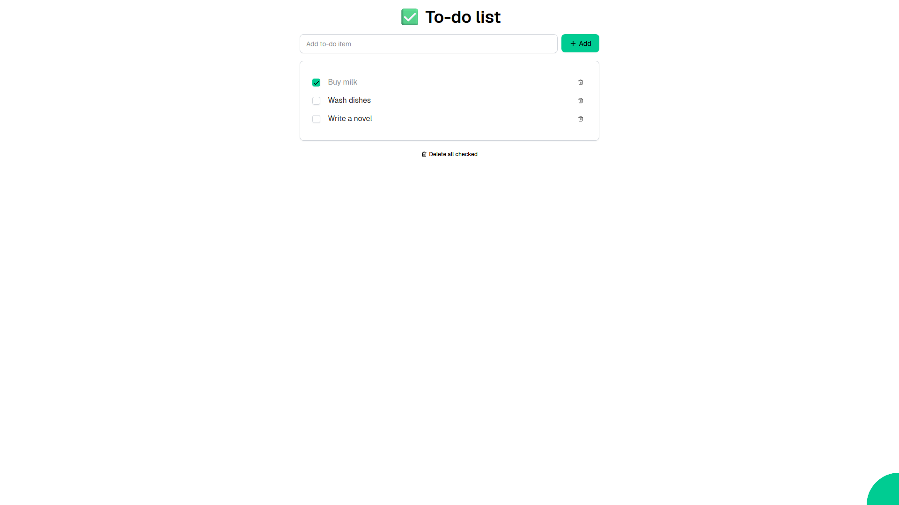

# Todo

A simple to-do list app that lets you add, check off, and delete tasks. Features include adding items via text input, toggling completion with checkboxes, deleting individual items, and bulk-deleting all checked items.



Web application created using [Ivy](https://github.com/Ivy-Interactive/Ivy).

## Required Secrets

No secrets required for this project.

## Live Demo

<https://ivy-agent-demos-todo.sliplane.app>

## Run

```
dotnet watch
```

## Deploy

```
ivy deploy
```
